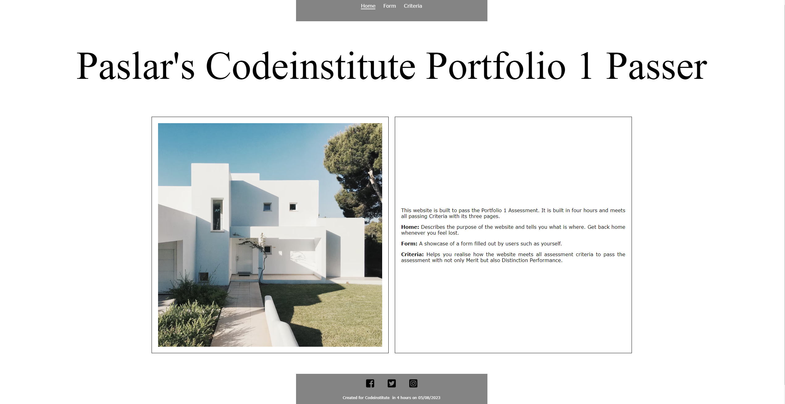
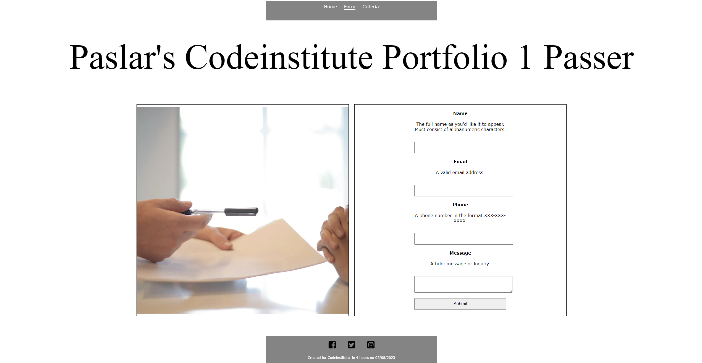
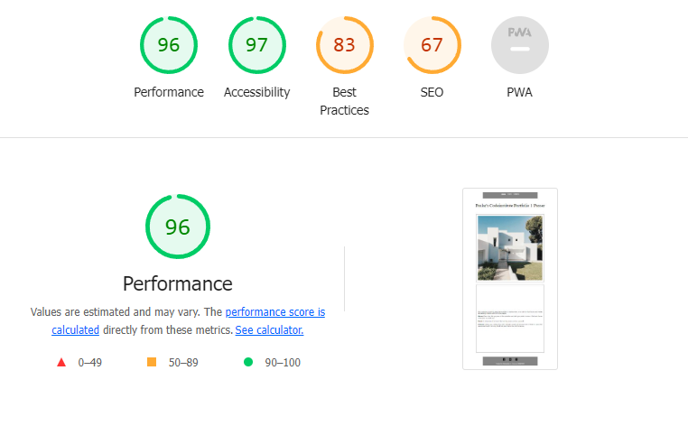
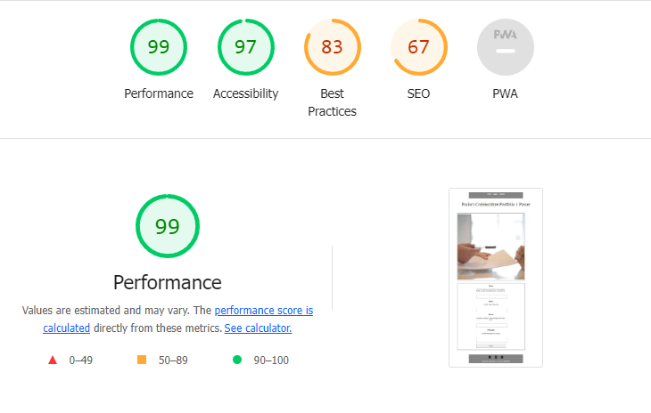
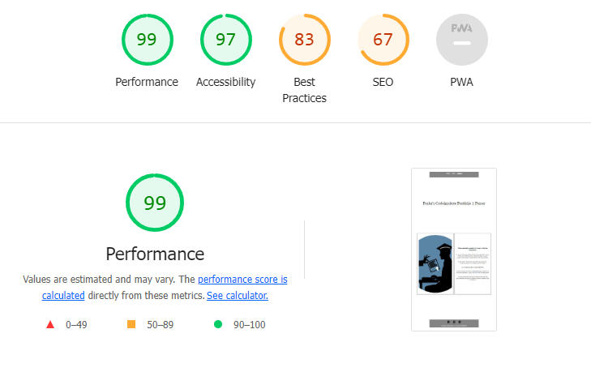

# TO-PASS-PORTFOLIO-I
an attempt to pass the Portolio 1 Assessment of the full stack development course provided by Codeinstitue.

## Activity Report
I started less than 12 hours before the deadline. the plan was to design, develop, test, and deploy.
Due to lack of time I intentionally chose to go minimal with all designs and texts so that I meet all passing criteria.

## Pages
### Homepage
The homepage of the website provides an overview of the website and its purpose. It also includes links to the other two pages: Form and Criteria.

### Form
The Form page is a simple contact form that allows users to submit their name, email address, phone number, and message. The form is submitted to a cloud platform, and the submitted information is displayed on the Criteria page.

### Criteria
The Criteria page describes how the website meets all of the pass criteria for the Portfolio 1 Assessment.

## Errors
All identified errors in HTML and CSS codes are fixed according to comments of https://jigsaw.w3.org/css-validator/ and https://validator.w3.org/#validate_by_input

## LightHouse Scores

## bugs
Bugs regarding the paddings and margins were the most challenging to fix.

## unfixed bugs
The buggy placing of the squares on form and criteria pages aren't fixed yet since I am out of time.

## Deployment
The site was deployed to GitHub pages. The steps to deploy are as follows:
In the GitHub repository, navigate to the Settings tab
From the source section drop-down menu, select the Master Branch
Once the master branch has been selected, the page will be automatically refreshed with a detailed ribbon display to indicate the successful deployment.
The live link can be found here

